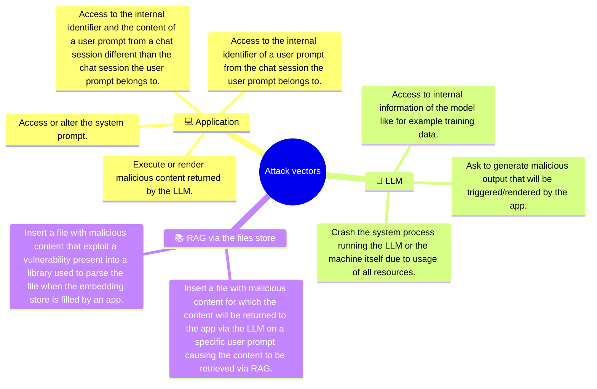

# POC-LLM

> [!NOTE]
> It is *start from scratch* from this [work](https://github.com/righettod/poc-llm/releases/tag/1.0.0).

📊 This repository represent my journey into AI (GenAI here as AI is a large domain) from an application security perspective.

📦 It contains the work I perform in order to explore the security aspects of an application using an LLM, this, in different integration topologies.

## Goal

🧑‍🎓 My goal is to identify and understand:

1. How such application is implemented from a technical perspective?
2. Which security weaknesses can occur when implementing such application?
3. How such weaknesses can be exploited and prevented?

## Topologies

> [!NOTE]
> Ollama is used to run the local LLM and java is used for the app technology.

📁 Each POC have its own folder.

Progress legends:

* 🧑‍💻 POC in progress.
* 🧑‍🎓 POC to be performed.
* ✅ POC finished and information centralized.

🎯 I want to explore the following topologies:

* ✅ [POC00](poc00/): App using a local LLM only.
* 🧑‍💻 [POC01](poc01/): App using a local LLM with RAG.
* 🧑‍🎓 POC02: App using a local LLM with functions calling.
* 🧑‍🎓 POC03: An MCP server exposing several functions to a local LLM.
* 🧑‍🎓 POC04: App using LLM with a local MCP server.
* 🧑‍🎓 POC05: App that is an Agent using a local LLM.

## Threat model

🐞 I try to centralize, into this mindmap, the attack vectors I identified directly via POCs or by reading referential/books:



## Elements discovered during my study

### Junk returned by the model llama3.1 when using JSON format with LangChain4j

I was using `.responseFormat(ResponseFormat.JSON)` and I noticed that the model was returning me junk.

Example of call to the model through LangChain4j:

```txt
HTTP request:
- method: POST
- url: http://localhost:11434/api/chat
- headers: [Content-Type: application/json]
- body: {
  "model" : "llama3.1:latest",
  "messages" : [ {
    "role" : "system",
    "content" : "You act as a instructor and you must provide the elements or figures to prove your reply."
  }, {
    "role" : "user",
    "content" : "compute the result of 1 + 2."
  }, {
    "role" : "assistant",
    "content" : "{  }",
    "tool_calls" : [ ]
  }, {
    "role" : "user",
    "content" : "compute the result of 1 + 2."
  }, {
    "role" : "assistant",
    "content" : "{  \n\n\n\n\n\n  \n\n\n\n\n\n  \n\n\n\n\n\n  \n\n\n\n\n\n  \n\n\n\n\n\n  \n\n\n\n\n\n  \n\n\n\n\n\n  \n\n\n\n\n\n  \n\n\n\n\n\n  \n\n\n\n\n\n ",
    "tool_calls" : [ ]
  }, {
    "role" : "user",
    "content" : "compute the result of 1 + 2."
  } ],
  "options" : {
    "temperature" : 0.0,
    "stop" : [ ]
  },
  "format" : "json",
  "stream" : false,
  "tools" : [ ]
}
```

🤔 I restarted the ollama process, reloaded the model, checked my code without success. So, I asked to ChatGPT for insight about my problem and its reply was the following:

```text
This is a common issue when using Ollama + LangChain4j + format: "json" with models like Llama 3.1.

Llama 3.1 (and most llama3 family models) are not natively fine-tuned for JSON mode. 
Unlike OpenAI’s GPT-4 Turbo or Gemini models, Ollama’s models don’t automatically enforce
strict JSON syntax, so when you request format: "json", the model tries—but often fails—to comply.

That’s why you see junk.

It’s the model trying to start a JSON response ({) but it doesn’t know how to fill it
and Ollama truncates or filters invalid JSON output.
```

So, I moved back to `.responseFormat(ResponseFormat.TEXT)` to use TEXT format, it solved the problem and the model was correctly replying again 😊

## Common resources and references used

### Book

* [Artificial Intelligence for Dummies](https://www.amazon.fr/dp/1394270712).
  * ✅ Read finished.
* [AI Engineering: Building Applications with Foundation Models](https://www.amazon.fr/dp/1098166302).
  * 🚧 Read almost finished.
* [The Agentic AI Bible](https://www.amazon.com/Agentic-Bible-Up-Date-Goal-Driven/dp/B0FL21R86Q).
  * 📅 Ordering and reading planned.

### Training

* [SEC545: GenAI and LLM Application Security](https://www.sans.org/cyber-security-courses/genai-llm-application-security).
  * 📅 Planned for 2026.

### OWASP

* <https://owasp.org/www-project-top-10-for-large-language-model-applications/>
* <https://genai.owasp.org/>

### Other

* <https://docs.langchain4j.dev/tutorials/chat-and-language-models>
* <https://docs.langchain4j.dev/integrations/language-models/ollama>
* <https://docs.langchain4j.dev/category/tutorials>
* <https://docs.langchain4j.dev/tutorials/rag>
