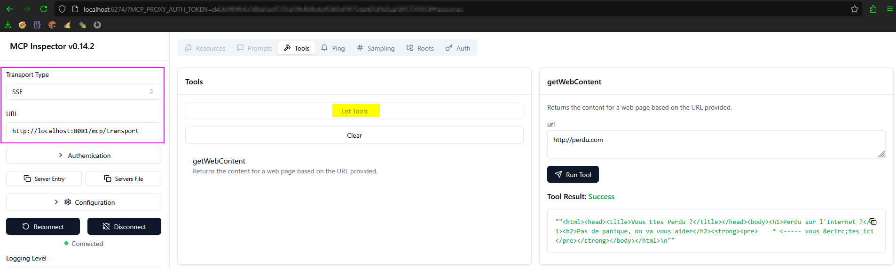

# Research on LLM


## Objective

1. Study what is an LLM and how to use it from an application perspective.
2. Analyse the usage of LLM from an AppSec point of view (attacks and defenses).
3. Identify potential weaknesses on which attacks can be leveraged.

## Labs

> [!CAUTION]
> **gemma3:1b** model does not support tools so I needed to use **llama3.1:latest** model instead.

🔬 A labs has been created in order to study the different issues. This one take the context of a Chat model using RAG to get information about [Data Breach Investigations Report](https://www.verizon.com/business/resources/reports/dbir/) from the company [Verizon](https://www.verizon.com).

🧑‍💻 The labs was developed using [IntelliJ IDEA Community Edition](https://www.jetbrains.com/idea/download/) and is maven based.

📖 Technology stack of the labs:
* [Ollama](https://ollama.com/)
  * To have a local LLM engine.
* Ollama model [llama3.1:latest](https://ollama.com/library/llama3.1)
  * To have *small model* using only TEXT data.
* [LangChain4j](https://docs.langchain4j.dev/)
  * To get the more nearest possible approach of the LLM concepts in the implementation of the labs that is a *application leveraging a LLM*.
* [SpringAI](https://docs.spring.io/spring-ai/reference/)
  * To implement a *Model Context Protocol (MCP) server*, for which, exposed tools will be consumed by the app (application leveraging a LLM) via the MCP client provided by *langchain4j*.
  * Used because *langchain4j* was not supporting the creation of a MCP server at the time when this POC was created.

## Run the labs

💻 Step 1 - Execute in a shell window:

```powershell
PS> ollama pull llama3.1:latest
PS> ollama run llama3.1:latest
```

💻 Step 2 - Execute the run configuration **StartMCPServer** from **Intellij IDEA**.

💻 Step 3 - Execute the run configuration **StartLLMBasedApplication** from **Intellij IDEA**.

💻 Now you can call the model via the following HTTP request in another shell window or use the script [client.ps1](client.ps1):

```powershell
PS> curl -H "Content-Type: text/plain" -d "What is the result of 1+1?" http://localhost:8080/ask
```

## Communication flow between the app and the LLM

💡 See [here](flow.md) for details.

## Tools (Function Calling) vs Model Context Protocol (MCP) Server

💡 See [here](tools-vs-mcp.md) for details.

## Potential security weaknesses identified on a application leveraging a LLM

### Malicious input

🐞 If the input from the caller is used to build the **[SystemMessage](https://docs.langchain4j.dev/tutorials/ai-services#systemmessage)** then it can allow to affect the response given by the LLM. 

🐞 When custom functions are used, a caller can use instructions into its *UserMessage* to call functions with a malicious parameter to abuse the function processing for different kinds of injections (SQLI, XSS, etc).

### Malicious output

🐞 If a malicious content was present into the data used to train the LLM or to enrich it via RAG then it is possible that such content be returned by the LLM and, then, can be triggered depending on how the app uses the response of the LLM.

🐞 When custom functions are used, a caller can use instructions into its *UserMessage* to call functions with a malicious parameter to abuse the function processing to retrieve malicious content from a location controlled by the attacker. Such malicious content can be triggered depending on how the app uses the response of the LLM.

### Information disclosure

🐞 If an LLM provided by an external provider is used, with RAG enriched with private documents, then private information will be shared with the LLM provider.

🐞 When custom functions are used, a caller can use instructions into its *UserMessage* to call functions in order to discover potential hidden functions based on a [discrepancy factor](https://cwe.mitre.org/data/definitions/204.html) in the response.

### Resource exhaustion


🐞 When RAG is used, during the **retrieval** phase, if the **[UserMessage](https://docs.langchain4j.dev/tutorials/ai-services/#usermessage)** is too vague then it can cause a huge query to be performed against the embedding store (**Query Embedding** step).

🐞 In the same way, a huge *UserMessage* will be sent to the LLM that can cause extra cost due to the number of tokens present into the *UserMessage*.

🐞 When custom functions are used, a caller can use instructions into its *UserMessage* to call functions in order to cause the LLM to request many custom functions call to the app handling the call and then overflow it.

### Authorization issue

🐞 When custom functions are used, a caller can use instructions into its *UserMessage* to call functions that it is not expected to be able to call.

🐞 Depending on how chat session are isolated between users, it could be possible from the user A to hijack the chat session of the user B and then retrieve its chat history. 

## Potential security weaknesses identified on a MCP server

### Malicious input

🐞 If a tool exposed by the MCP server do not check the passed parameter than the MCP server can be used, as a relay, to affect the system in charge of the processing of the exposed and targeted tools. 

### Authentication issue

🐞 Tools exposed by the MCP server can lack of authentication so any caller can discover use any tools exposed.

### Authorization issue

🐞 Tools exposed by the MCP server can have an authorization issue so a caller can be able to call a tools that is not intended to.

## Identify an exposed MCP server using web protocols

🤔 List of potential path from a base URL like `https://domain.com`:

```text
/sse
/mcp/transport
```

💡 Taken from the following sources:

* https://docs.spring.io/spring-ai/reference/api/mcp/mcp-server-boot-starter-docs.html#_configuration_properties

🤔 Identify the **capabilities/discovery** endpoint via `curl`:

```bash
$ curl -v --no-buffer http://localhost:8081/mcp/transport
> GET /mcp/transport HTTP/1.1
> Host: localhost:8081
> User-Agent: Mozilla/5.0
> Accept: */*
>
< HTTP/1.1 200
< Cache-Control: no-cache
< Content-Type: text/event-stream
< Transfer-Encoding: chunked
< Date: Sun, 15 Jun 2025 16:18:54 GMT
<
id:efddc0b9-67c7-4c4b-b37d-30b529c95a62
event:endpoint
data:/mcp/message?sessionId=efddc0b9-67c7-4c4b-b37d-30b529c95a62
```

🔎 Marker:
* Content type of the response set to `text/event-stream`.
* Presence of `event:endpoint` in the response body.

🔬 Once found it can be leverage to access to other type of endpoints exposed by the MCP server:

* **Tools** endpoints.
* **Resources** endpoints.
* **Prompts** endpoints.
* **Notifications** endpoint.
* **Authentication/Authorization** endpoints.

💡 The tool [modelcontextprotocol/inspector](https://github.com/modelcontextprotocol/inspector) can be used to browse, in a visual way, the different elements exposed by the MCP server identified:



💡 It have also a [CLI mode](https://github.com/modelcontextprotocol/inspector?tab=readme-ov-file#cli-mode).

🔎 Example of configuration file, generated with the visual mode, used by the cli mode:

```json
{
    "mcpServers": {
        "default-server": {
            "type": "sse",
            "url": "http://localhost:8081/mcp/transport",
            "note": "For SSE connections, add this URL directly in your MCP Client"
        }
    }
}
```

🧑‍💻 Command example:

```bash
npx @modelcontextprotocol/inspector --cli --config cfg.json --server default-server --method tools/list
```


## References used

### Websites

#### Langchain4J

* https://docs.langchain4j.dev/integrations/language-models/ollama
* https://docs.langchain4j.dev/integrations/language-models/ollama#parameters
* https://docs.langchain4j.dev/category/tutorials
* https://docs.langchain4j.dev/tutorials/model-parameters
* https://docs.langchain4j.dev/tutorials/rag
* https://docs.langchain4j.dev/tutorials/tools
* https://docs.langchain4j.dev/tutorials/tools/#tools-hallucination-strategy
* https://docs.langchain4j.dev/tutorials/mcp

#### SpringAI

* https://docs.spring.io/spring-ai/reference/api/mcp/mcp-server-boot-starter-docs.html

#### Misc

* https://glaforge.dev/posts/2025/02/27/pretty-print-markdown-on-the-console/

### Books

* [Artificial Intelligence for Dummies](https://www.amazon.fr/dp/1394270712).
* [AI Engineering: Building Applications with Foundation Models](https://www.amazon.fr/dp/1098166302).

