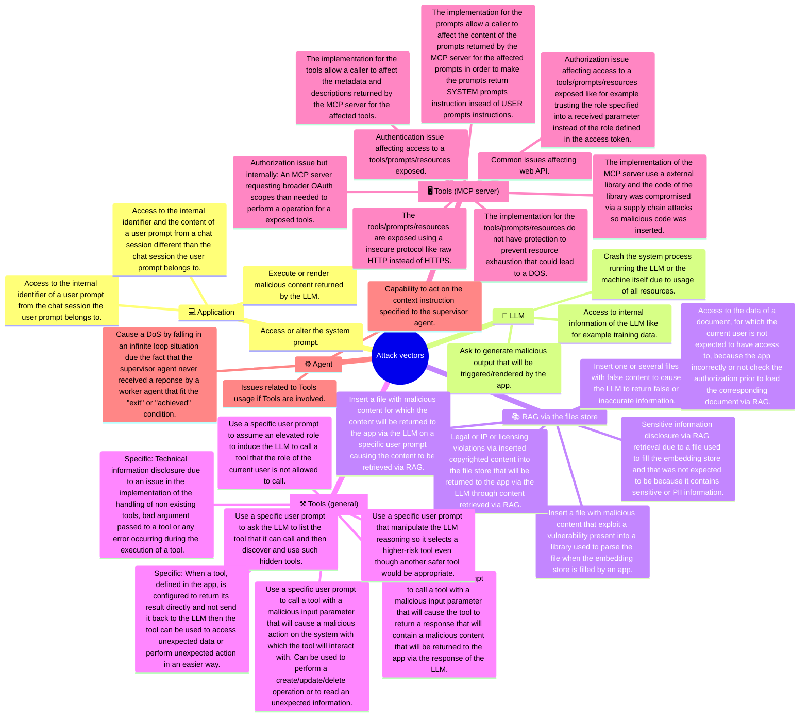

# POC-LLM


> [!NOTE]
> It is *start from scratch* from this [work](https://github.com/righettod/poc-llm/releases/tag/1.0.0).

📊 This repository represent my journey into AI (GenAI here as AI is a large domain) from an application security perspective.

📦 It contains the work I perform in order to explore the security aspects:

- Of an application using an LLM, this, in different integration topologies.
- When leveraging the features of an coding assistant.

## Goal

🧑‍🎓 My goal is to identify and understand:

1. How such application is implemented from a technical perspective?
2. Which security weaknesses can occur when implementing such application?
3. How such weaknesses can be exploited and prevented?
4. How a coding assistant can be leveraged to include the security aspect?

## Topologies

> [!NOTE]
> Ollama is used to run the local LLM and java/python are used for the app technologies.

📁 Each POC have its own folder.

🗺️ Progress legends:

- 🧑‍🎓 POC **to be performed**.
- 🧑‍💻 POC **in progress**.
- ✅ POC **finished** and information centralized.

🎯 I want to explore the following topologies & concepts:

- ✅ [POC00](poc00/): App using a local LLM only.
- ✅ [POC01](poc01/): App using a local LLM with RAG.
- ✅ [POC02](poc02/): App using a local LLM with Tools (Function Calling).
- ✅ [POC03](poc03/): An MCP server exposing several functions to a local LLM.
- ✅ [POC04](poc04/): App that is an Agent using a local LLM.
- ✅ [POC05](poc05/): Exploration of Claude code command to perform [threat modeling](https://en.wikipedia.org/wiki/Threat_model) activity against a [User Story](https://www.atlassian.com/agile/project-management/user-stories).
- ✅ [POC06](poc06/): Explore the capability to leverage claude code to perform a secure code review of a code base.
- 🧑‍💻 [POC07](poc07/): Try to map for a SDLC every step in which GenAI can be used or bring useful help.

## Threat model

🐞 I try to centralize, into the mindmap below, the attack vectors I identified either:

- Directly via POCs.
- By reading referential/books.
- By asking help to GEMINI (models **2.5 Flash** / **Fast**) or ChatGPT (model **ChatGPT**).



## Elements discovered during my study

### Junk returned by the model llama3.1 when using JSON format with LangChain4j

I was using `.responseFormat(ResponseFormat.JSON)` and I noticed that the model was returning me junk.

Example of call to the model through LangChain4j:

```txt
HTTP request:
- method: POST
- url: http://localhost:11434/api/chat
- headers: [Content-Type: application/json]
- body: {
  "model" : "llama3.1:latest",
  "messages" : [ {
    "role" : "system",
    "content" : "You act as a instructor and you must provide the elements or figures to prove your reply."
  }, {
    "role" : "user",
    "content" : "compute the result of 1 + 2."
  }, {
    "role" : "assistant",
    "content" : "{  }",
    "tool_calls" : [ ]
  }, {
    "role" : "user",
    "content" : "compute the result of 1 + 2."
  }, {
    "role" : "assistant",
    "content" : "{  \n\n\n\n\n\n  \n\n\n\n\n\n  \n\n\n\n\n\n  \n\n\n\n\n\n  \n\n\n\n\n\n  \n\n\n\n\n\n  \n\n\n\n\n\n  \n\n\n\n\n\n  \n\n\n\n\n\n  \n\n\n\n\n\n ",
    "tool_calls" : [ ]
  }, {
    "role" : "user",
    "content" : "compute the result of 1 + 2."
  } ],
  "options" : {
    "temperature" : 0.0,
    "stop" : [ ]
  },
  "format" : "json",
  "stream" : false,
  "tools" : [ ]
}
```

🤔 I restarted the ollama process, reloaded the model, checked my code without success. So, I asked to ChatGPT for insight about my problem and its reply was the following:

```text
This is a common issue when using Ollama + LangChain4j + format: "json" with models like Llama 3.1.

Llama 3.1 (and most llama3 family models) are not natively fine-tuned for JSON mode. 
Unlike OpenAI’s GPT-4 Turbo or Gemini models, Ollama’s models don’t automatically enforce
strict JSON syntax, so when you request format: "json", the model tries—but often fails—to comply.

That’s why you see junk.

It’s the model trying to start a JSON response ({) but it doesn’t know how to fill it
and Ollama truncates or filters invalid JSON output.
```

So, I moved back to `.responseFormat(ResponseFormat.TEXT)` to use TEXT format, it solved the problem and the model was correctly replying again 😊

## Feedback

🤝 The folder [feedback](feedback/) contains pending work on some blog posts to share my feedback regarding my exploration.

## Common resources and references used

### Book

- [Artificial Intelligence for Dummies](https://www.amazon.fr/dp/1394270712).
  - ✅ Read finished: Very interesting.
- [AI Engineering: Building Applications with Foundation Models](https://www.amazon.fr/dp/1098166302).
  - ✅ Read finished: Very interesting - A amazing book in terms of structure and content!
- [OWASP AI Testing Guide](https://owasp.org/www-project-ai-testing-guide/)
  - ✅ Read finished: Very interesting.
- [The Agentic AI Bible](https://www.amazon.com/Agentic-Bible-Up-Date-Goal-Driven/dp/B0FL21R86Q).
  - ⚠️ I rage quit the reading of the book and **made a return to Amazon!**
  - The book is an entire continuous wall of text that seems generated with AI. It don't provide effective and useful content.
- [Applied AI for Building Intelligent Systems](https://www.amazon.fr/dp/0135489687).  
  - 🔬 Read in progress.

### Training

- [SEC545: GenAI and LLM Application Security](https://www.sans.org/cyber-security-courses/genai-llm-application-security-5day).
  - ✅ Followed.

### OWASP

- <https://owasp.org/www-project-top-10-for-large-language-model-applications/>
- <https://genai.owasp.org/>

### Model Context Protocol Security

- <https://modelcontextprotocol-security.io/>
- <https://modelcontextprotocol.io/>
- <https://modelcontextprotocol-security.io/top10/server/>
- <https://modelcontextprotocol.io/docs/tutorials/security>
- <https://docs.spring.io/spring-ai/reference/2.0-SNAPSHOT/api/mcp/mcp-security.html>

### Tools

- <https://modelcontextprotocol.io/docs/tools/inspector>
- <https://github.com/modelcontextprotocol/inspector?tab=readme-ov-file#cli-mode>
- <https://github.com/f/mcptools>

### Other

- <https://docs.langchain4j.dev/tutorials/tools/#returning-immediately-the-result-of-a-tool-execution-request>
- <https://docs.langchain4j.dev/tutorials/chat-and-language-models>
- <https://docs.langchain4j.dev/integrations/language-models/ollama>
- <https://docs.langchain4j.dev/category/tutorials>
- <https://docs.langchain4j.dev/tutorials/rag>
- <https://docs.langchain4j.dev/tutorials/tools>
- <https://blog.kulkan.com/assessing-the-attack-surface-of-remote-mcp-servers-92d630a0cab0>
- <https://blog.christianposta.com/the-updated-mcp-oauth-spec-is-a-mess/>
- <https://damienbod.com/2025/10/16/implement-a-secure-mcp-oauth-desktop-client-using-oauth-and-entra-id/>
