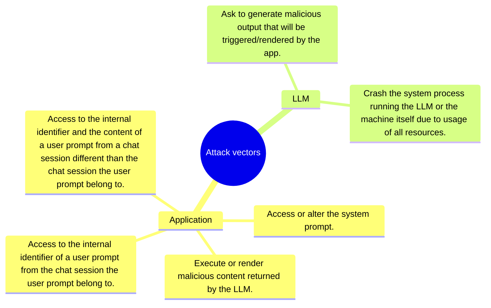

# POC-LLM

> [!NOTE]
> It is *start from scratch* from this [work](https://github.com/righettod/poc-llm/releases/tag/1.0.0).

📊 This repository represent my journey into AI (GenAI here as AI is a large domain) from an application security perspective.

📦 It contains the work I perform in order to explore the security aspects of an application using an LLM, this, in different integration topologies.

## Goal

🧑‍🎓 My goal is to identify and understand:

1. How such application is implemented from a technical perspective?
2. Which security weaknesses can occur when implementing such application?
3. How such weaknesses can be exploited and prevented?

## Topologies

> [!NOTE]
> Ollama is used to run the local LLM and java is used for the app technology.

📁 Each POC have its own folder.

Progress legends:

* 🧑‍💻 POC in progress.
* 🧑‍🎓 POC to be performed.
* ✅ POC finished and information centralized.

🎯 I want to explore the following topologies:

* 🧑‍💻 [POC00](poc00/): App using a local LLM only.
* 🧑‍🎓 POC01: App using a local LLM with RAG.
* 🧑‍🎓 POC02: App using a local LLM with functions calling.
* 🧑‍🎓 POC03: An MCP server exposing several functions to a local LLM.
* 🧑‍🎓 POC04: App using LLM with a local MCP server.
* 🧑‍🎓 POC05: App that is an Agent using a local LLM.

## Threat model

🐞 I try to centralize, into this mindmap, the attack vectors I identified directly via POCs or by reading referential/books:

## Common resources and references used

### Book

* [Artificial Intelligence for Dummies](https://www.amazon.fr/dp/1394270712).
  * ✅ Read finished.
* [AI Engineering: Building Applications with Foundation Models](https://www.amazon.fr/dp/1098166302).
  * 🚧 Read almost finished.
* [The Agentic AI Bible](https://www.amazon.com/Agentic-Bible-Up-Date-Goal-Driven/dp/B0FL21R86Q).
  * 📅 Ordering and reading planned.

### Training

* [SEC545: GenAI and LLM Application Security](https://www.sans.org/cyber-security-courses/genai-llm-application-security).
  * 📅 Planned for 2026.

### OWASP

* <https://owasp.org/www-project-top-10-for-large-language-model-applications/>
* <https://genai.owasp.org/>
