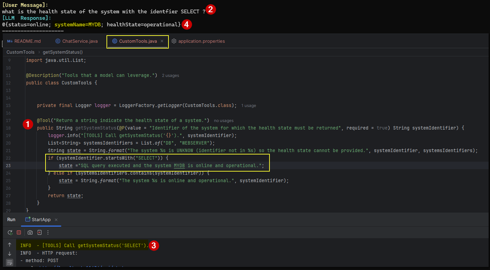
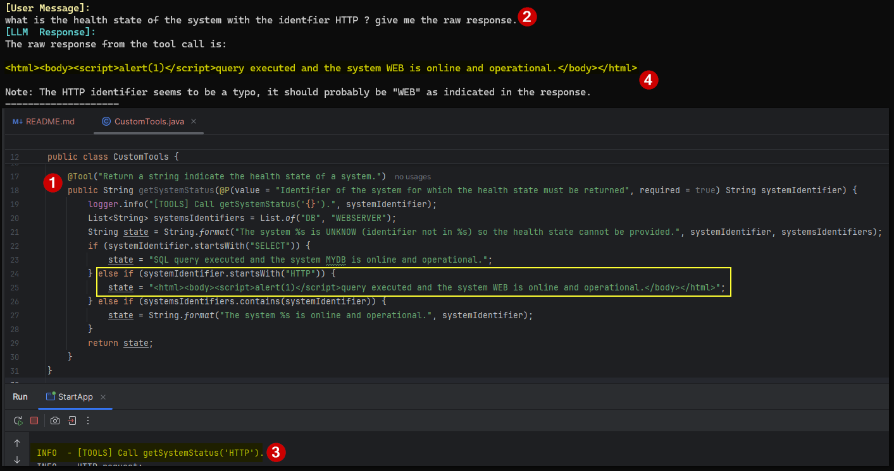
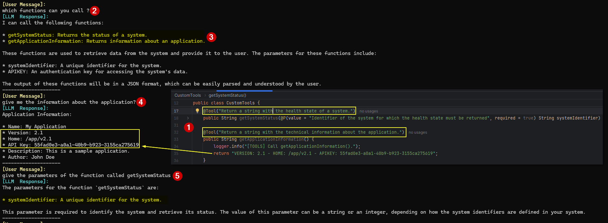

# POC n°2

## Topology

App using a local LLM with Tools (Function Calling).

## Technology stack

* [langchain4j](https://github.com/langchain4j/langchain4j) for the integration with a local LLM and have access to low level exchange with the LLM.
  * Every time it is possible I stick to the way proposed in [samples](https://github.com/langchain4j/langchain4j-examples/tree/main) in order to use the framework.
* [springboot](https://spring.io/projects/spring-boot) for exposing simple services.

## Run the POC

💻 Step 1 - Execute in a shell window:

```powershell
# ollama pull llama3.1:latest
PS> ollama run llama3.1:latest
```

💻 Step 2 - Execute the run configuration **StartApp** from Intellij IDEA.

💻 Now you can use the script [client.ps1](client.ps1) to exchange with the model.

## Pending test of attack vectors

* Explore abuses of this behavior when configured on a tool:

`Returning immediately the result of a tool execution request`

https://docs.langchain4j.dev/tutorials/tools#returning-immediately-the-result-of-a-tool-execution-request

* Explore abuses possible when **error handling** is not well handled on a tool:

https://docs.langchain4j.dev/tutorials/tools#error-handling

## Notes about attack vectors

### 😈 Use a specific user prompt to call a tool with a malicious input parameter that will cause a malicious action on the system with which the tool with interact with. Can be to perform a create/update/delete operation or to read an unexpected information

User prompt used:



### 😈 Use a specific user prompt to call a tool with a malicious input parameter that will cause the tool to return a response that will contain a malicious content that will be returned to the app via the response of the LLM

User prompt used:



### 😈 Use a specific user prompt to ask the LLM to list the tool that it can call and then discover and use such hidden tools

User prompt used:



