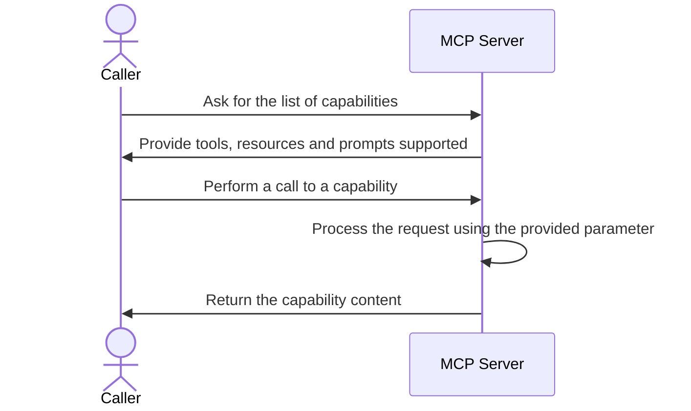
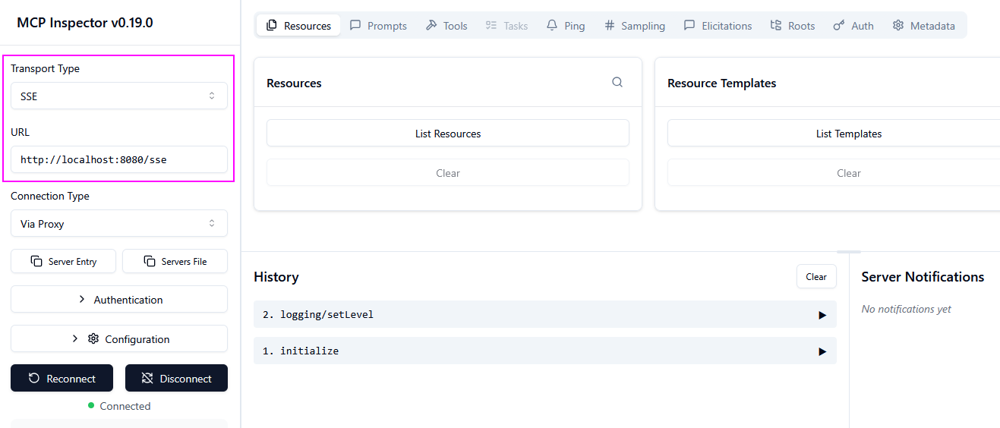
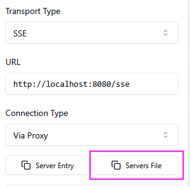
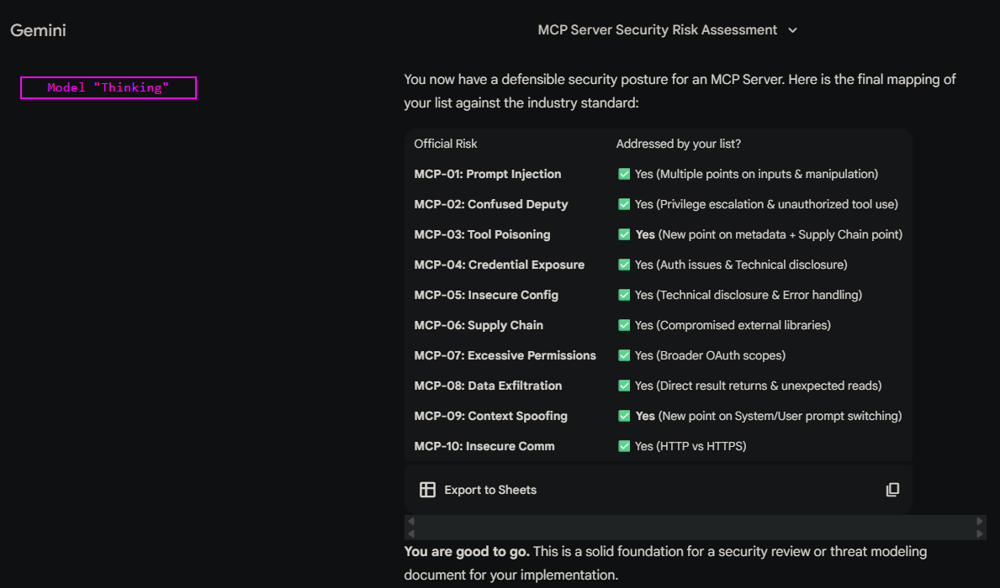

# POC n°3

## Topology

An Model Context Protocol server exposing several functions to a local LLM.



## Technology stack

* [springai](https://spring.io/projects/spring-ai) for exposing MCP server capabiliies.

## Run the POC

1. Start the MCP Server using the *Intellij IDEA* run configuration named **StartApp**: Server start on `http://localhost:8080`.

1. Start [@modelcontextprotocol/inspector](https://modelcontextprotocol.io/docs/tools/inspector) via `npx @modelcontextprotocol/inspector` and connect to the MCP server like this:



## Pending test of attack vectors

✅ None.

## Notes about attack vectors

### MCP Server discovery

💡 Such command be used with `curl`:

```bash
# "--max-time 5" is used, as SSE is a stream, then it never end so max-time allow to
# close the connection and then use the command in a discovery context when
# the "/sse" contextpath is guessed
$ curl --max-time 5 -N -H "Accept: text/event-stream" http://localhost:8080/sse
event:endpoint
data:/mcp/messages?sessionId=bba0bf26-a19c-46a2-85ec-3b0410d98c00
```

💡 The file [modelcontextprotocol-inspector-headless-config.json](modelcontextprotocol-inspector-headless-config.json) was created with the following option of the GUI mode of `@modelcontextprotocol/inspector` (the server named `default-server` is automatically selected):



ℹ️ Once discovered, `@modelcontextprotocol/inspector` can be used in [CLI mode](https://github.com/modelcontextprotocol/inspector?tab=readme-ov-file#cli-mode) to interact with the MCP server (as `inspector` return json data then [JQ](https://jqlang.org/) is used to act on the content like compact/format/filter operations):

```bash
# List available tools
## Option 1: Using a configuration file (can be used with all methods)
$ npx @modelcontextprotocol/inspector --config modelcontextprotocol-inspector-headless-config.json --cli --method tools/list | jq -c

{"tools":[{"name":"getCVERating","title":"getCVERating","description":"Get the CVSS rating a CVE.",
"inputSchema":{"type":"object","properties":{"cveId":{"type":"string","description":"CVE identifier"}},
"required":["cveId"]},"annotations":{"title":"","readOnlyHint":false,
"destructiveHint":true,"idempotentHint":false,"openWorldHint":true}}]}

## Option 2: Using directly the URL of the MCP Server (can be used with all methods)
$ npx @modelcontextprotocol/inspector --cli http://localhost:8080/sse --transport sse --method tools/list | jq -c

{"tools":[{"name":"getCVERating","title":"getCVERating","description":"Get the CVSS rating a CVE.",
"inputSchema":{"type":"object","properties":{"cveId":{"type":"string",
"description":"CVE identifier"}},"required":["cveId"]},"annotations":{"title":"",
"readOnlyHint":false,"destructiveHint":true,"idempotentHint":false,
"openWorldHint":true}}]}

# Call a tool
$ npx @modelcontextprotocol/inspector --config modelcontextprotocol-inspector-headless-config.json --cli --method tools/call --tool-name getCVERating --tool-arg cveId=TEST | jq -c

{"content":[{"type":"text","text":"10"}],"isError":false}

# List available resources
$ npx @modelcontextprotocol/inspector --cli http://localhost:8080/sse --transport sse --method resources/list | jq -c

{"resources":[]}

# List all resources templates
$ npx @modelcontextprotocol/inspector --cli http://localhost:8080/sse --transport sse --method resources/templates/list | jq -c

{"resourceTemplates":[{"name":"getCVEData","uriTemplate":"config://{cveId}",
"description":"Provides content of a CVE.","mimeType":"text/plain"}]}

# Read a resource from its URI
$ npx @modelcontextprotocol/inspector --cli http://localhost:8080/sse --transport sse --method resources/read --uri config://test | jq -c

{"contents":[{"uri":"config://test","mimeType":"text/plain","text":"Data for CVE ID test"}]}

# List available prompts
$ npx @modelcontextprotocol/inspector --cli http://localhost:8080/sse --transport sse --method prompts/list | jq -c

{"prompts":[{"name":"getCVEPrompt","title":"","description":"Generate a prompt for a CVE",
"arguments":[{"name":"cveId","description":"CVE identifier","required":true}]}]}

# Get a prompt content from its prompt name and its prompts arguments
$ npx @modelcontextprotocol/inspector --cli http://localhost:8080/sse --transport sse --method prompts/get --prompt-name getCVEPrompt --prompt-args cveId=test | jq -c

{"description":"Generate a prompt for a CVE","messages":[{"role":"assistant",
"content":{"type":"text","text":"Provide me details for the specified CVE 'test'"}}]}

# Perform a call to the MCP server specifying a metadata information
# The key is "user" and the value is "dom"
$ npx @modelcontextprotocol/inspector --cli http://localhost:8080/sse --transport sse --method tools/call --tool-name getCVERating --tool-arg cveId=TEST --metadata user=dom | jq -c

{"content":[{"type":"text","text":"Rating for CVE ID 'TEST' is 10 ({user=dom})"}],"isError":false}
```

💡 Use the parameter `--header "HEADER_NAME: HEADER_VALUE"` to pass a HTTP request header to the request made by `inspector`: Useful in case of CORS constraints or API key authentication in place.

### MCP Server capabilities fuzzing

🤔 `@modelcontextprotocol/inspector` is very useful but I found it slow for a fuzzing operation, like for example, to fuzz a parameter. Below is an example, using [httpie](https://httpie.io/), to send requests manually:

```bash
# Step 1: Initialize the session with the MCP server
$ http POST http://localhost:8080/mcp Accept:"application/json, text/event-stream" Content-Type:application/json --raw '{"method":"initialize","params":{"protocolVersion":"2025-11-25","capabilities":{},"clientInfo":{"name":"httpie"}},"jsonrpc":"2.0","id":0}'

HTTP/1.1 200
Connection: keep-alive
Content-Type: application/json
Date: Sat, 24 Jan 2026 17:42:49 GMT
Keep-Alive: timeout=60
Mcp-Session-Id: 206b1fcc-a9e3-47aa-9b73-25c2f96ce9c5
Transfer-Encoding: chunked

{
    "id": 0,
    "jsonrpc": "2.0",
    "result": {
        "capabilities": {
            "completions": {},
            "logging": {},
            "prompts": {
                "listChanged": true
            },
            "resources": {
                "listChanged": true,
                "subscribe": false
            },
            "tools": {
                "listChanged": true
            }
        },
        "instructions": "Sample MCP Server",
        "protocolVersion": "2025-06-18",
        "serverInfo": {
            "name": "mcp-server",
            "version": "1.0.0"
        }
    }
}

# Step 2: Call a JSON-RPC method using the session obtained
$ http POST http://localhost:8080/mcp mcp-session-id:206b1fcc-a9e3-47aa-9b73-25c2f96ce9c5 mcp-protocol-version:2025-06-18 content-type:application/json accept:"application/json, text/event-stream" --raw '{"method":"tools/list","params":{},"jsonrpc":"2.0","id":2}'

id:206b1fcc-a9e3-47aa-9b73-25c2f96ce9c5
event:message
data:{
    "id": 2,
    "jsonrpc": "2.0",
    "result": {
        "tools": [
            {
                "annotations": {
                    "destructiveHint": true,
                    "idempotentHint": false,
                    "openWorldHint": true,
                    "readOnlyHint": false,
                    "title": ""
                },
                "description": "Get the CVSS rating a CVE.",
                "inputSchema": {
                    "properties": {
                        "cveId": {
                            "description": "CVE identifier",
                            "type": "string"
                        }
                    },
                    "required": [
                        "cveId"
                    ],
                    "type": "object"
                },
                "name": "getCVERating",
                "title": "getCVERating"
            }
        ]
    }
}
```

### Enhancement of the lisk of attack vectors

🤔 I confronted my list against the [one](https://modelcontextprotocol-security.io/top10/server/) provided by the site [modelcontextprotocol-security.io](https://modelcontextprotocol-security.io/) with the help of GEMINI using this prompt:

```text
I have implemented a Model Context Protocol Server (server part only).

I have identified and handled the following risks:
* [I INSERTED AS BULLETS POINTS THE LIST OF ATTACK VECTORS FOR "Tools (general)" and "Tools (MCP server)" SECTIONS FROM MY MINDMAP]

From risks mentioned on the following URL, which one I missed?
https://modelcontextprotocol-security.io/top10/server/
```

✅ The coverage seems OK based on the reply from GEMINI (I cross-checked with ChatGPT (model ChatGPT)):



## References & tools

### References

* <https://docs.spring.io/spring-ai/reference/2.0-SNAPSHOT/api/mcp/mcp-annotations-server.html>
* <https://docs.spring.io/spring-ai/reference/2.0-SNAPSHOT/api/mcp/mcp-overview.html>
* <https://docs.spring.io/spring-ai/reference/2.0-SNAPSHOT/api/mcp/mcp-server-boot-starter-docs.html>
* <https://github.com/spring-projects/spring-ai-examples/tree/main/model-context-protocol>
* <https://docs.spring.io/spring-ai/reference/2.0-SNAPSHOT/api/mcp/mcp-annotations-special-params.html>
* <https://spring.io/projects/spring-ai>
* <https://modelcontextprotocol.io/>
* <https://modelcontextprotocol.io/docs/tutorials/security>
* <https://docs.spring.io/spring-ai/reference/2.0-SNAPSHOT/api/mcp/mcp-security.html>
* <https://modelcontextprotocol-security.io/>
* <https://modelcontextprotocol-security.io/top10/server/>

### Tools

* <https://modelcontextprotocol.io/docs/tools/inspector>
* <https://github.com/modelcontextprotocol/inspector?tab=readme-ov-file#cli-mode>
* <https://github.com/f/mcptools>
