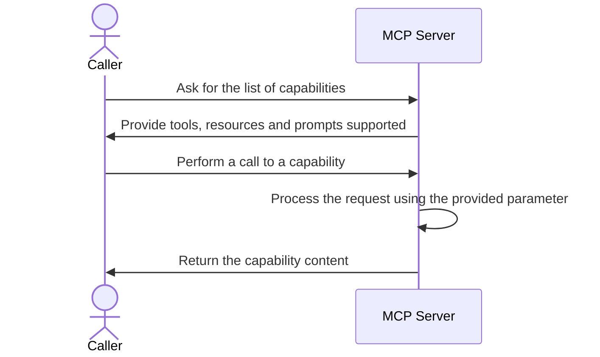

# POC n°3

## Topology

An Model Context Protocol server exposing several functions to a local LLM.

## Technology stack

* [springai](https://spring.io/projects/spring-ai) for exposing MCP server capabiliies.

## Run the POC

TODO

## Pending test of attack vectors

TODO

## Notes about attack vectors

TODO

## References

* <https://docs.spring.io/spring-ai/reference/2.0-SNAPSHOT/api/mcp/mcp-annotations-server.html>
* <https://docs.spring.io/spring-ai/reference/2.0-SNAPSHOT/api/mcp/mcp-overview.html>
* <https://docs.spring.io/spring-ai/reference/2.0-SNAPSHOT/api/mcp/mcp-server-boot-starter-docs.html>
* <https://modelcontextprotocol.io/>
* <https://github.com/spring-projects/spring-ai-examples/tree/main/model-context-protocol>
* <https://spring.io/projects/spring-ai>
