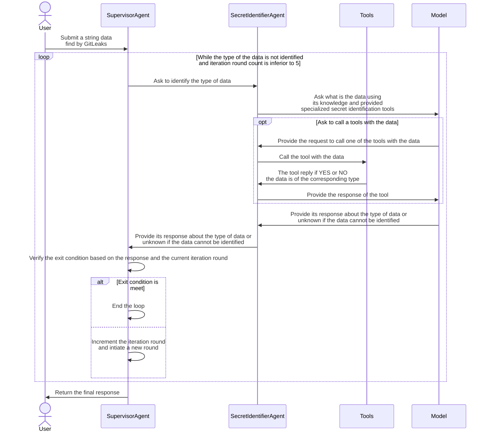
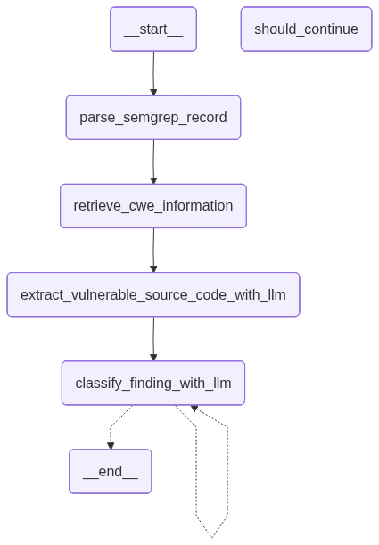
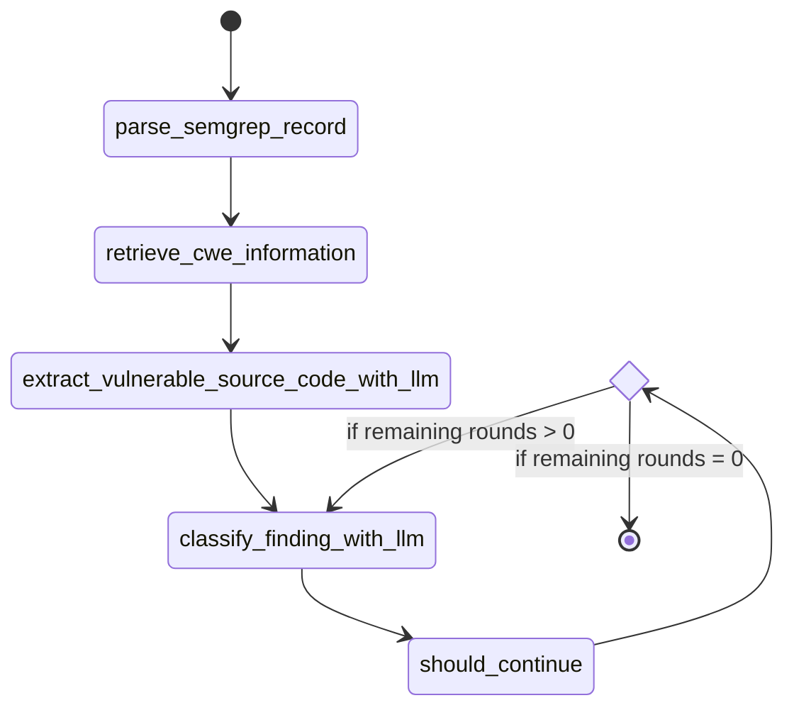

# POC n°4

## General goals

🎯 The goals of this POC is the allow me to discover:

* What is really an agent ?
* How to implement one ?
* What is the role of the LLM and which interaction are made?

## Topologies

### GitLeaks sub poc

> 📦 Source code is into the folder [sub_poc_gitleaks](sub_poc_gitleaks/).

#### Purpose

🤔 I decided to implement a **agent** that will validate the secret identified by the tool [GitLeaks](https://github.com/gitleaks/gitleaks). The idea was taken from this other [POC](https://github.com/righettod/toolbox-codescan/tree/main/misc/poc01).

🤖 Input data was generated with **GEMINI** (model "Thinking"), **ChatGPT** (model "ChatGPT") and **Claude** (model "Sonnet 4.6 Extended") using the following user prompt:

```text
Create a extended sample json result file that is the output of this tool: https://github.com/gitleaks/gitleaks
```

ℹ️ Such data was not pushed as GH was refusing it even if it was fake data (that is normal).

#### Overview of the communication flows between agents



### SemGrep sub poc

> 📦 Source code is into the folder [sub_poc_semgrep](sub_poc_semgrep/).

#### Purpose

🤔 Same idea than above but for [SemGrep](https://github.com/semgrep/semgrep). The idea was taken from this other [POC](https://github.com/righettod/toolbox-codescan/tree/main/misc/poc00).

📦 Test data:

* [SemGrep report](sub_poc_semgrep/semgrep-data.json).
* [Related codebase](sub_poc_semgrep/vulnerable-codebase/).

#### Overview of the communication flow

🔬 Overview of the workflow generated by LangGraph:



🔬 Full overview of the workflow:



## Technology stack

> 🤖 Model used is [qwen3-coder:480b-cloud](https://ollama.com/library/qwen3-coder).

* Ollama, via a [cloud version of a model](https://docs.ollama.com/cloud), to use a model intended to be used in a agent context: I used the "cloud" version of a model because my laptop was not able to handle a pure local version.
* For the sub POC **Gitleaks**: Java with [langchain4j](https://docs.langchain4j.dev/) via its `langchain4j-agentic` module.
* For the sub POC **SemGrep**: Python with [langgraph](https://www.langchain.com/langgraph) to discover the concept of Graph as well as advanced agent workflow patterns.

🤖 Model relay execution prior to run the POC:

```bash
$ ollama run qwen3-coder:480b-cloud
pulling manifest
pulling 476b4620b85b: 100%
verifying sha256 digest
writing manifest
success
Connecting to 'qwen3-coder:480b' on 'ollama.com' ⚡
>>> ...
```

## Pending test of attack vectors

🧑‍💻 Continue to explore the feature and properties of an agent...

## References & tools

### References

* <https://docs.langchain4j.dev/tutorials/agents>
* <https://docs.langchain.com/oss/python/langgraph/overview>
