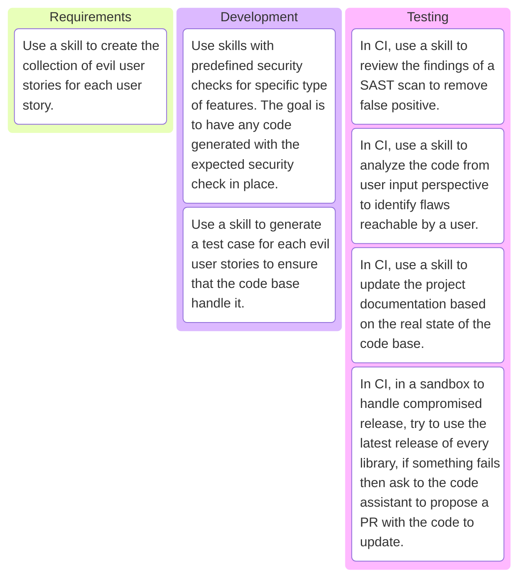

# POC n°7

## General goals

🎯 The goal of this POC is to explore for an SLDC every step in which GenIA can be used and possibility how? The real goal is to have a visual representation.

```mermaid
kanban
    step01[Requirements]
        step01-task00[Use a skill to create the collection of evil user stories for each user story.]
    step02[Development]
        step02-task00[Use skills with predefined security checks for specific type of features. The goal is to have any code generated with the expected security check in place.]
        step02-task01[Use a skill to generate a test case for each evil user stories to ensure that the code base handle it.]
    step03[Testing]    
        step03-task01[In CI, use a skill to review the findings of a SAST scan to remove false positive.]
        step03-task02[In CI, use a skill to analyze the code from user input perspective to identify flaws reachable by a user.]
        step03-task03[In CI, use a skill to update the project documentation based on the real state of the code base.]     
        step03-task04[In CI, in a sandbox to handle compromised release, try to use the latest release of every library, if something fails then ask to the code assistant to propose a PR with the code to update.]               
```
