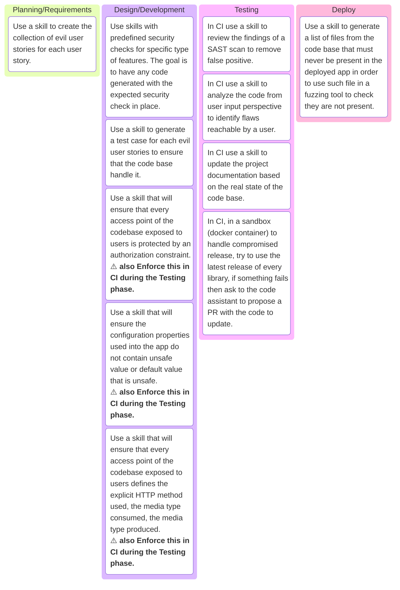

# POC n°7

## General goals

🎯 The goal of this POC is to explore for an SLDC every step in which GenIA can be used and possibility how?

🤔 My real goal is to have a visual representation of possibilities even if it's far-fetched or paranoid.

ℹ️ Note about choice and way of working:

* I use many times a dedicated **skill** in order to leverage as much as possible, the capabilities of a coding assistant as it can easily access to the codebase.
* I used Claude to validate/challenge my idea, from Claude code perspective, as it is the coding assistant I used.

💡 Ideas:

## References

* <https://www.headmind.com/evil-user-stories/>
* <https://mermaid.js.org/syntax/kanban.html>
