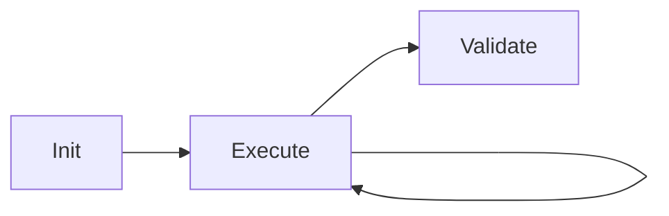

# CLAUDE.md — API Security Assessment Agent

2026-09-19 · @Someone

## Goal and Scope

A single-job autonomous agent that performs a security assessment of one REST API service from a single valid HTTP request, producing structured output consumable by a downstream validator agent.

- **In scope:** one service, one HTTP request as input, one assessment run, one findings report
- **Out of scope:** orchestration across multiple services, parallelism, aggregation — deferred to a future orchestrator layer
- The agent is intentionally incomplete in v1 — correctness and traceability over exhaustive coverage

## Architecture

LangGraph graph with three nodes. No LLM in Init — it is pure deterministic Python that fails fast if inputs are invalid.



**Init node** — deterministic, no LLM

1. Parse raw HTTP request file into a dict
2. Extract method, path, host, headers, body
3. Fetch fresh access token and replace the `Authorization` header value
4. Load the external markdown test list (contains all tests — OWASP-tagged and custom)
5. Build the test registry from the markdown file, each entry `pending`
6. Set the OOB listener URL from input
7. Hand off to Execute with fully populated state

**Execute node** — ReAct agent (LangGraph `create_react_agent`)

- Runs one test at a time with a fresh LLM context per test
- Has access to all 4 tools
- Can reorder tests freely but must mark every test executed or blocked
- Appends agent-invented exploratory tests to the test registry as `exploratory`
- Accumulates raw request/response log and findings list into state
- Loops until all tests in the registry are `executed`, `blocked`, or `skipped`

**Validate node** — single LLM call, separate model

- Receives the full accumulated state (test registry + findings list + request log)
- Produces validated, deduplicated, severity-ranked output
- Deferred to a future design; the Execute node's output is its input contract

## Tool Set

Four tools, no overlap. All active network traffic goes through tool 3 — the single controlled egress point.

| # | Tool | Responsibility |
| --- | --- | --- |
| 1 | `get_access_token` | Fetch a fresh bearer token at Init time |
| 2 | `get_security_tests` | Load the external markdown test list |
| 3 | `send_http_request` | Send a crafted HTTP request to the target; enforces scope (domain allowlist) in code; accepts a base request dict + overrides (path, headers, body, method); records timestamp and sequence number; returns raw response |
| 4 | `get_oob_hits` | Poll the pre-provisioned OOB listener for callback hits |

**Scope enforcement** lives inside tool 3, not in the agent. The agent cannot change the target host — any override that changes the host is rejected silently and logged as a scope violation.

## State Schema

Two categories. Static context is set at Init and never mutated. Accumulating data grows during Execute.

**Static context** (read-only after Init)

| Field | Type | Source |
| --- | --- | --- |
| `base_request` | `dict` | Parsed from input HTTP file |
| `target_host` | `str` | Extracted from `Host` header |
| `oob_listener_url` | `str` | Passed as agent input |
| `access_token` | `str` | Fetched by `get_access_token` |
| `test_registry` | `list[TestEntry]` | Built from the markdown test file |

**Accumulating data** (appended during Execute)

| Field | Type | Description |
| --- | --- | --- |
| `request_log` | `list[RequestEntry]` | Every HTTP request sent, in sequence |
| `findings` | `list[Finding]` | One entry per confirmed or suspected issue |

**TestEntry fields:** `id`, `source` (owasp / custom / exploratory), `status` (pending / executed / blocked / skipped), `auth_mode` (authenticated / anonymous / both), `oob_required` (bool), `block_reason` (str, if blocked)

**RequestEntry fields:** `sequence_no`, `timestamp`, `parent_test_id`, `intent`, `auth_mode_used`, `raw_request` (str), `raw_response` (str)

**Finding fields:** `id`, `test_id`, `owasp_ref` (or `custom` / `exploratory`), `severity`, `status` (confirmed / suspected / not_vulnerable), `request_sequence_nos` (list), `agent_reasoning` (str)

## Input Format

The agent takes three inputs at launch:

1. **HTTP request file** — a plain text file in raw HTTP format (Burp Suite export compatible)
2. **OOB listener URL** — pre-provisioned before the agent starts, passed as a string
3. **Credentials config** — whatever `get_access_token` needs to fetch a fresh token

Example HTTP request file:

```http
GET /api/v1/user/1 HTTP/1.1
Host: example.com
Accept-Language: en-US,en;q=0.9
User-Agent: Mozilla/5.0 (Windows NT 10.0; Win64; x64)
Authorization: Bearer XXXXX
Accept: */*
Connection: keep-alive
```

**Parsing rules (Init node)**

- Line 1 → method, path, HTTP version
- `Host` header → `target_host` (used for scope enforcement)
- `Authorization: Bearer XXXXX` → placeholder detected, replaced with fresh token at runtime
- Blank line separates headers from body (body captured if present, e.g. POST with JSON payload)
- Result stored as a plain `dict` in state (not an `httpx.Request` object — keeps state JSON-serializable)
- `httpx` reconstructs the request object inside `send_http_request` tool from the dict + overrides

## Test List Format

An external markdown file — versioned independently from code. One `##` section per test. All tests live here — both OWASP-tagged and custom. The agent reads this file via `get_security_tests` at Init.

Each section contains these fields:

| Field | Values | Purpose |
| --- | --- | --- |
| `owasp_ref` | e.g. `API1:2023` or `none` | Links finding to OWASP taxonomy |
| `severity` | `critical / high / medium / low / info` | Baseline severity, agent may adjust |
| `auth_mode` | `authenticated / anonymous / both` | Drives token usage; `both` means run twice and compare responses |
| `oob_required` | `true / false` | Whether the OOB listener URL should be embedded in payloads |
| `what_to_do` | free text | Test steps for the agent |
| `what_to_look_for` | free text | Success/failure indicators in the response |

Example section:

```markdown
## BOLA — Access Another User's Object

- **owasp_ref:** API1:2023
- **severity:** high
- **auth_mode:** both
- **oob_required:** false

**What to do:** Replace the resource ID in the path with another valid or sequential ID. Try numeric enumeration (1, 2, 3) and UUIDs if the original ID is a UUID.

**What to look for:** A 200 response returning another user's data when authenticated as a different user, or any data returned when anonymous.
```

**`both` auth_mode behaviour:** the agent runs the test twice — once anonymous, once authenticated — and compares responses. A matching response regardless of auth state is itself a finding.

## Per-Test Agent Context

Each test gets a fresh LLM context — the full accumulated request log and findings are not injected. This keeps the context window bounded and prevents earlier findings from biasing the current test.

What the ReAct agent receives per test:

```
Target: GET /api/v1/user/1 — example.com
OOB listener: https://oob.example.net/abc123
Access token: eyJ...

Current test: BOLA — Access Another User's Object
[full test section content from markdown]

Tests performed: 3 / 12    Findings so far: 2

- API1:2023 BOLA              → executed   finding detected
- API2:2023 Broken Auth       → executed   no finding
- API3:2023 BFLA             → blocked    timeout
```

**Why this structure:**

- Base request + token → agent can craft variants without guessing the target shape
- OOB URL → agent knows when and where to embed it, no tool call needed to provision it
- Current test definition → agent has full instructions and success criteria
- Progress summary → agent can spot patterns, avoid re-running completed tests, and decide whether to add exploratory tests
- Findings count → signals density of issues found; may influence agent's decision to go deeper on a category

**Test execution order** is the agent's decision — it may reorder freely. The progress summary ensures it never loses track of what has been covered.

## Output Format

Two markdown documents produced at the end of the Execute node, consumed by the Validate node.

**1. Findings report** — one `##` section per finding

```markdown
## FINDING-001 — BOLA: Unauthorized Access to User Object

- **owasp_ref:** API1:2023
- **severity:** high
- **status:** confirmed
- **test_id:** bola-01
- **request_refs:** #4, #5

**Agent reasoning:** Replacing user ID 1 with ID 2 in the path returned a 200 with another user's PII while authenticated as user 1. Anonymous request returned the same data.
```

**2. Test execution log** — one `##` section per test, with all requests sent under it

```markdown
## API1:2023 — BOLA

- **source:** owasp
- **status:** executed
- **auth_mode:** both
- **findings:** FINDING-001

### Request #4 — 2026-09-19 14:32:07

- **intent:** Access user ID 2 authenticated as user 1
- **auth_mode:** authenticated

```http
GET /api/v1/user/2 HTTP/1.1
Host: example.com
Authorization: Bearer eyJ...
```

```http
HTTP/1.1 200 OK
Content-Type: application/json

{"id": 2, "name": "Jane Doe", "email": "jane@example.com"}
```
```

Blocked tests are still logged with reason:

```markdown
## API3:2023 — BFLA

- **source:** owasp
- **status:** blocked
- **block_reason:** timeout after 10s
```

## Error Handling

All error handling is designed to keep the agent moving rather than stopping. No retries — each issue is recorded and the next test starts.

| Condition | Behaviour | Test status |
| --- | --- | --- |
| Request timeout | Log timeout in request log, record reason | `blocked` |
| HTTP 429 Too Many Requests | Treat same as timeout — client is expected to have whitelisted the assessment IP | `blocked` |
| Network error | Log error message in request log | `blocked` |
| Scope violation (host mismatch) | Tool rejects the call silently, logs as scope violation | `blocked` |
| Token fetch failure | Init node fails fast — no Execute starts | hard stop |
| Test file not found | Init node fails fast | hard stop |

**Rationale for 429 treatment:** in the expected operating context the target client is responsible for whitelisting the assessment IP. A 429 is their infrastructure problem, not a signal to back off. The blocked status flags it for manual follow-up.

**Hard stops only happen at Init** - once Execute starts, the agent never stops mid-run. Every test gets a status, even if that status is `blocked`.

## Future Evolution

The current design is intentionally minimal. Each evolution adds a node or wraps the current graph — no rewrites required.

**Validate node (next step)**

- Consumes findings report + test execution log from state
- Single LLM call with a separate, potentially cheaper model
- Produces validated, deduplicated, severity-ranked findings
- Can be extended into a multi-step subgraph later without changing its interface to the Execute node

**Orchestrator agent**

- Takes a collection of HTTP request files as input
- Distributes one file per assessment agent instance
- Current assessment graph becomes a LangGraph subgraph
- Runs instances in parallel using LangGraph's parallel edges
- Aggregates findings across all instances

**Other evolutions (when needed)**

- Human-in-the-loop interrupt before destructive or aggressive tests
- Dynamic test list generation based on API shape inferred from the initial request
- Vulnerability scanner integration as a fifth tool with its own scoped egress
- Multiple entry points — feed findings from a prior run directly into the Validate node without re-executing
